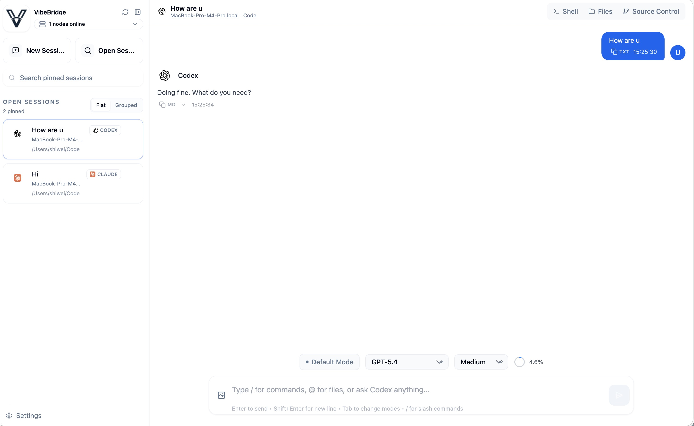

<div align="center">
  
  <h1>VibeBridge</h1>
  <p>
    用一个浏览器界面，统一管理一台或多台机器上的 Claude Code 与 Codex 会话。
  </p>
</div>

<div align="right"><i><a href="./README.md">English</a> · <b>中文</b></i></div>

---

<p align="center">
  
</p>

## 概览

`VibeBridge` 是一个多节点浏览器控制面，用一个界面统一运行和管理一台或多台机器上的 `Claude Code` 与 `Codex`。

## 聊天体验

VibeBridge 的聊天界面不是把底层事件原样摊开，而是尽量让主消息流保持“答案优先”。

- 每一轮对话都会突出最后一条正式回复，中间的工具调用、思考和 compact 过程会收进可折叠的过程区。
- 没有明显中间过程的轮次不会出现空的过程容器，整体阅读会更干净。
- 重新打开会话时，历史状态能更完整地恢复，包括 Codex 的 compact 历史。
- Codex 会话对长输出的处理更稳定，整体使用感受会更接近 Codex app。

## 架构

```text
Browser
  -> Main Server (main_server.py)
       - serve dist/
       - auth + JWT
       - node registry and routing
       - browser WebSocket and shell relay
  -> Node Server(s) (app.py)
       - connect to Main
       - run Claude Code / Codex locally
       - expose local project, filesystem, shell, and Git APIs
```

浏览器只应该访问 Main，Node 负责执行，不应该被当成独立页面入口。

## 连接方式

### 1. Node 直连 Main WebSocket

在 `configs/node.toml` 中设置 `node.main_server_url`。

### 2. Node 先 HTTP 注册，再由 Main 主动回连

在 `configs/node.toml` 中设置 `node.main_register_url`。

如果两个配置同时存在，当前实现会优先使用直连 WebSocket。若 Main 回连 Node 需要使用不同地址，可设置 `node.advertise_host` 和 `node.advertise_port`。

<a id="quick-start"></a>

## 快速开始

### 1. 安装后端依赖

```bash
cd /path/to/VibeBridge
pip install -r requirements.txt
```

环境管理方式不限，推荐使用独立 virtualenv 或 conda 环境。

### 2. 创建运行配置文件

```bash
cd /path/to/VibeBridge
cp configs/main.toml.example configs/main.toml
cp configs/node.toml.example configs/node.toml
```

如果 Main 和 Node 在同一台机器上联调，建议把两个文件里的 `database.path` 改成不同值，避免共用同一个 SQLite 文件。若 Node 需要连接其他 Main，也在这里修改 `node.main_server_url` 或 `node.main_register_url`。

### 3. 启动 Main Server

```bash
cd /path/to/VibeBridge
python main_server.py
```

### 4. 启动一个 Node Server

```bash
cd /path/to/VibeBridge
python app.py
```

如果要接入更多节点，只需要在其他机器上重复 Node 侧配置，并准备各自的 `configs/node.toml`。

### 5. 打开界面

```text
http://127.0.0.1:4457/
```

如果数据库为空，第一次访问会进入注册流程。

## 配置说明

| 文件或键 | 作用角色 | 说明 |
| --- | --- | --- |
| `configs/main.toml` | Main | Main 运行配置 |
| `configs/node.toml` | Node | Node 运行配置 |
| `server.host` / `server.port` | Main / Node | 监听地址和端口 |
| `database.path` | Main / Node | SQLite 数据库路径 |
| `auth.jwt_secret` | Main | JWT 密钥；未设置时会自动生成并保存 |
| `main.node_register_tokens` | Main | 允许节点注册的 token 列表 |
| `main.node_addresses` | Main | Main 启动后主动连接的节点地址 |
| `node.main_server_url` | Node | 直连 Main 的 WebSocket 地址 |
| `node.main_register_url` | Node | 供 Main 回连模式使用的 HTTP 注册地址 |
| `node.id` / `node.name` | Node | 节点稳定标识和显示名称 |
| `node.register_token` | Node | 节点注册 token |
| `node.labels` / `node.capabilities` | Node | 节点标签和能力声明 |
| `node.advertise_host` / `node.advertise_port` | Node | 指定 Main 回连该 Node 时应使用的地址 |
| `filesystem.*` | Node | 文件浏览限制 |
| `terminal.default_shell` | Node | 内置终端默认 shell |
| `providers.claude.*` / `providers.codex.*` | Node | Provider 相关超时和限制 |

## 目录结构

```text
VibeBridge/
├── app.py
├── main_server.py
├── config.py
├── configs/
├── database/
├── main/
├── middleware/
├── providers/
├── routes/
├── ws/
├── frontend-src/
└── dist/
```

建议先从这些文件读起：

- `main_server.py`
- `app.py`
- `node_connector.py`
- `main/browser_gateway.py`
- `providers/claude_sdk.py`
- `providers/codex_mcp.py`

## Provider

### Claude

- 实现文件：`providers/claude_sdk.py`
- 走真实 Python SDK 链路
- 依赖：`claude-agent-sdk`

### Codex

- 实现文件：`providers/codex_mcp.py`
- 优先使用 `codex mcp-server`
- MCP 初始化失败时会回退到 `codex exec --json`
- 重载旧会话时可以恢复 compact 历史
- 节点机器上需要可用的 `codex` CLI

## 验证方式

Main:

```bash
curl -sf http://<main-host>:4457/health
```

Node:

```bash
curl -sf http://<node-host>:4456/health
```

## 备注

- 仓库里已经带了 `dist/`，只有前端代码变更时才需要重新构建。
- `Dockerfile` 当前只覆盖 Node 角色。

<a id="acknowledgements"></a>

## 致谢

- [claudecodeui](https://github.com/siteboon/claudecodeui)
- [happy](https://github.com/slopus/happy)
